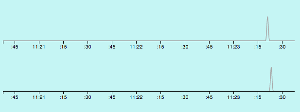

Snoopy
------

Remember to `npm install`

Start with `node server`

An HTTP server will now be listening on 8080. The socket server will be listening to 8081.

A demo of using Node's `cluster` module to create multiple socket servers sharing a single port. The goal is to have a small probe report user actions to an administration interface. 

This interface will show time series information for user actions (currently, mousemove). To reach this interface visit `localhost:8080/admin/spasquali`

Now open any number of `localhost:8080` pages in your browser. Move your mouse around. You will see this activity register in the admin. 

When a page disconnects, the admin will remove that user's display. 

